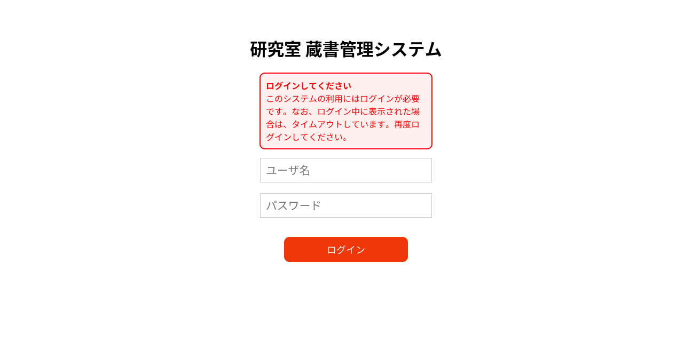
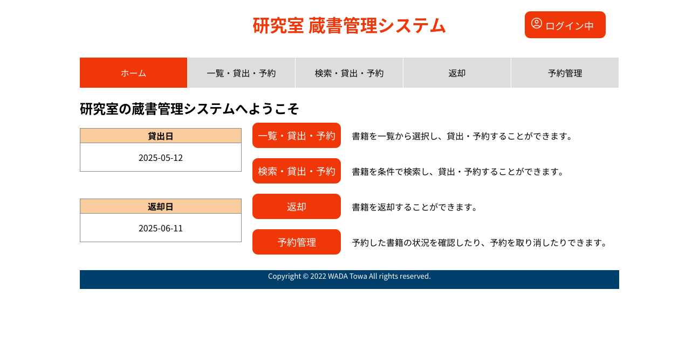
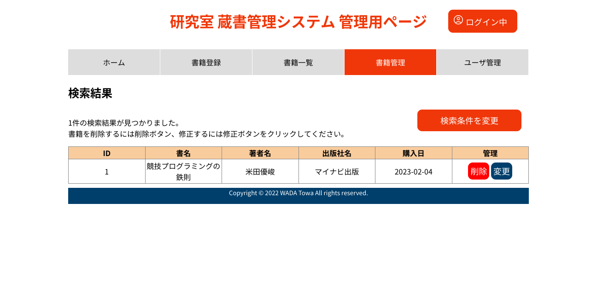

# lab-library-manager
研究室での利用を想定した蔵書管理システムです。  
大学のPythonの授業で最終課題として作成しました。

## 特徴
* 複数の書籍の情報(タイトル、著者、出版社、購入日)の管理
* 書籍の検索、貸出、返却、貸出予約、書評の登録が可能
* 書籍やユーザを管理する管理者と、書籍の貸出、返却などを行う一般ユーザを登録可能
* ユーザIDとパスワードによるログイン機能を搭載
* データベースの初期化も容易に実行可能

## 利用方法
1. リポジトリをクローン
1. `pip install -r requirements.txt`を実行し、必要なモジュールをインストール
1. `python3 finrp.py`を実行してプログラムを起動
1. `http://{プログラムを実行したデバイスのIPアドレス}:8080/login`にアクセス
1. まずは管理者としてログイン(管理者の初期ユーザID: admin、初期パスワード: 12345678)
1. ログイン後、一般ユーザの追加や書籍の登録などを画面の支持に従って実施

※初期化は、`python3 finrp.py init`を実行することで実施できる

## 動作確認環境
* Windows 10 22H2、Ubuntu 22.04 LTS
* Microsoft Edge、Mozilla Firefox
* Python 3.10
* bcrypt 4.0.1
* bottle 0.12.23
* Jinja2 3.1.2

## スクリーンショット

